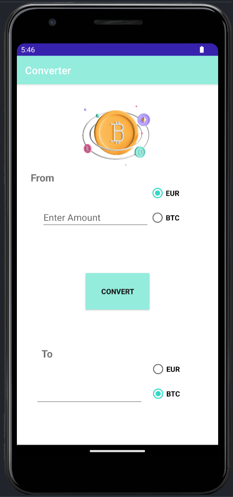

 

    
     
    <h1 align="center">Crypto Converter</h1>

  <h4 align="center">
    Practical work - Android App
  </h4>
 

 
 

<!-- TABLE OF CONTENTS -->

  
Table of Contents

  <ol>
    <li><a href="#illustration">Illustration</a></li>
    <li><a href="#description">Description</a></li>
    <li><a href="#languages">Languages</a></li>
    <li><a href="#objectives">Objectives</a></li>
    <li><a href="#setup">Setup</a></li>
    <li><a href="#status">Status</a></li>
    <li><a href="#context">Context</a></li>
  </ol>

 
 

## ✨ Illustration 

## 🗒 Description 
- Create a Euro/Bitcoin currency converter
- Minimum SDK version to use : API 21 - Android Lollipop

## 🛠 Languages and tools
- Java
- Android Studio
- Gradle

## 🎯 Objectives 
The objective of this practical work is to become familiar with the environment and the development of mobile applications, in order to focus on the study of Android security.

## ⚙️ Setup 
How to launch the program :

## 📈 Status 

Project completed

## 🗓 Context 

I realized this practical work during my bachelor of computer science in the Institute of technology of Vannes
